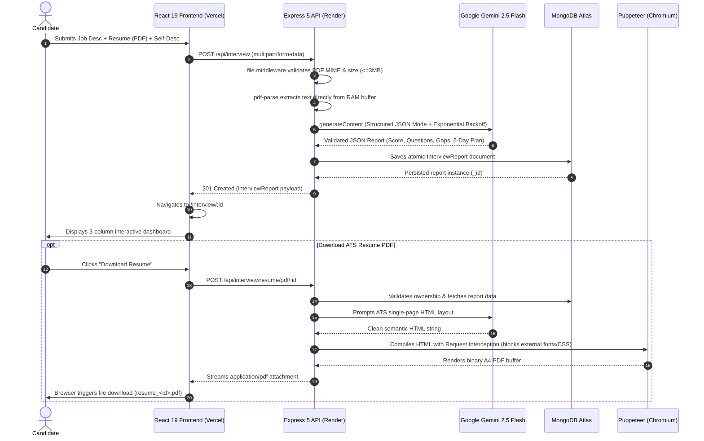

# 🎯 interviewforge — AI-Powered Interview Preparation Platform

[](https://opensource.org/licenses/MIT)
[](https://nodejs.org/)
[](https://expressjs.com/)
[](https://react.dev/)
[](https://vitejs.dev/)
[](https://www.mongodb.com/atlas)
[](https://ai.google.dev/)
[](https://pptr.dev/)

> **Generate targeted interview reports, skill gap analyses, day-by-day preparation roadmaps, and custom ATS-compliant resume PDFs from your profile and target job description.**

---

## 🌐 Live Deployments

- **Frontend Application (Vercel):** [https://interviewforge-theta.vercel.app](https://interviewforge-theta.vercel.app)
- **REST API Backend (Render):** [https://interviewforge-5m9t.onrender.com](https://interviewforge-5m9t.onrender.com)

---

## 📑 Table of Contents

- [Overview](#-overview)
- [System Architecture](#-system-architecture)
- [Key Features](#-key-features)
- [Design System & Frontend Architecture](#-design-system--frontend-architecture)
- [Technical Deep-Dive](#-technical-deep-dive)
  - [1. GenAI Prompt Orchestration & Resilience](#1-genai-prompt-orchestration--resilience)
  - [2. In-Memory Resume Parsing](#2-in-memory-resume-parsing)
  - [3. Headless Document Compilation (Puppeteer)](#3-headless-document-compilation-puppeteer)
  - [4. Authentication, Revocation & Modern Cookie Standards](#4-authentication-revocation--modern-cookie-standards)
  - [5. Database Modeling & Query Optimization](#5-database-modeling--query-optimization)
- [Tech Stack](#-tech-stack)
- [API Reference](#-api-reference)
- [Environment Variables](#-environment-variables)
- [Local Development Setup](#-local-development-setup)
- [Production Deployment](#-production-deployment)
- [Security & Architectural Resilience](#-security--architectural-resilience)
- [Author & License](#-author--license)

---

## 📸 Overview

**interviewforge** addresses the preparation gap between a candidate's background and specific job requirements. Rather than generic interview question lists, the platform consumes three data dimensions:
1. **Raw PDF Resume** (parsed in-memory via `pdf-parse`)
2. **Target Job Description** (responsibilities, required tech stack, and seniority level)
3. **Optional Candidate Self-Description** (clarifying strengths, context, or experience)

The system passes these inputs to **Google Gemini 2.5 Flash** using deterministic JSON schema enforcement to generate an actionable preparation report and a tailored, single-page ATS-formatted resume PDF compiled via **Puppeteer**.

---

## 🏗️ System Architecture

```
interviewforge/
├── frontend/                          # React 19 + Vite SPA (Client Layer)
│   ├── public/                        # Static assets
│   ├── src/
│   │   ├── components/
│   │   │   ├── Loader.jsx             # Accessible full-screen spinner overlay
│   │   │   └── SphereBackground.jsx   # 3D interactive faceted wireframe canvas
│   │   ├── features/
│   │   │   ├── auth/                  # Authentication domain
│   │   │   │   ├── auth.form.scss     # Modern brutalist form styling
│   │   │   │   ├── components/Protected.jsx # Client-side route guard
│   │   │   │   ├── context/           # AuthContext & Session Provider
│   │   │   │   ├── hooks/useAuth.js   # Encapsulated login/register/logout actions
│   │   │   │   ├── pages/             # Login & Register views
│   │   │   │   └── services/auth.api.js # Axios instance with timeout controls
│   │   │   └── interview/             # Interview intelligence domain
│   │   │       ├── hooks/useInterview.js # Report generation & blob download logic
│   │   │       ├── interview.context.jsx # Global report state management
│   │   │       ├── pages/
│   │   │       │   ├── Home.jsx       # Input workspace & past reports archive
│   │   │       │   └── Interview.jsx  # 3-column analysis dashboard
│   │   │       ├── services/interview.api.js # Axios interceptors & blob handlers
│   │   │       └── style/
│   │   │           ├── home.scss      # Workspace grid & archive cards
│   │   │           └── interview.scss # Score ring, question accordions & roadmap
│   │   ├── styles/
│   │   │   └── _tokens.scss           # Design system tokens (colors, type, mixins)
│   │   ├── App.jsx                    # Root component with providers & 3D canvas
│   │   ├── app.routes.jsx             # React Router v7 route definitions
│   │   ├── main.jsx                   # StrictMode initialization
│   │   └── style.scss                 # Global resets, typography & loader
│   ├── vercel.json                    # Single-Page Application rewrite rules
│   └── vite.config.js                 # Dev server proxy configuration
│
└── backend/                           # Node.js + Express 5 REST API (Server Layer)
    ├── render-build.sh                # Linux container build script (installs Chromium)
    ├── server.js                      # Server bootstrap & MongoDB connection
    └── src/
        ├── app.js                     # Express app setup, CORS, JSON/cookie parsers
        ├── config/database.js         # Mongoose connection with fail-fast logic
        ├── controllers/
        │   ├── auth.controller.js     # Auth endpoints & cookie emission
        │   └── interview.controller.js # AI generation, report query, PDF compilation
        ├── middlewares/
        │   ├── auth.middleware.js     # JWT verification & blacklist lookup
        │   └── file.middleware.js     # Multer 3MB memory storage validation
        ├── models/
        │   ├── blacklist.model.js     # Token blacklist schema with 1-hr TTL index
        │   ├── interviewReport.model.js # Embedded report schema (questions, gaps, plan)
        │   └── user.model.js          # User schema with regex & hash constraints
        ├── routes/
        │   ├── auth.routes.js         # /api/auth routes
        │   └── interview.routes.js    # /api/interview routes
        └── services/
            └── ai.service.js          # Gemini 2.5 Flash orchestration & Puppeteer engine
```

### End-to-End Data Pipeline



---

## ✨ Key Features

- **🔐 Dual-Layer Authentication** — Stateless JWT issued via cross-site, secure, partitioned HTTP-only cookies, combined with a MongoDB-backed token revocation blacklist.
- **📄 Memory-Buffered Resume Parsing** — Uploaded PDFs are parsed directly in RAM via `pdf-parse`, avoiding disk I/O and leaving zero leftover files on cloud containers.
- **🤖 Structured GenAI Reasoning (Gemini 2.5 Flash)**:
  - **Match Score:** Quantified profile compatibility index ($0–100\%$).
  - **5 Technical Questions:** Targeted conceptual and implementation questions with interviewer intention and comprehensive model answers.
  - **4 Behavioral Questions:** Situation-based questions paired with structured STAR-method answers.
  - **4 Categorized Skill Gaps:** Identified skill discrepancies tagged by severity (`low`, `medium`, `high`).
  - **5-Day Preparation Roadmap:** Day-by-day structured study curriculum with actionable tasks.
- **📑 Headless ATS Resume Compilation** — Uses Puppeteer to transform tailored profile data into a single-page, ATS-optimized A4 PDF with custom injected print CSS.
- **🎨 Technical Brutalist UI/UX** — High-performance dark aesthetic featuring an interactive 3D rotating wireframe canvas, bracketed monospace labels, SVG circular score indicators, and smooth zero-blur panel scrolling.
- **📋 Historical Report Archive** — Past interviews are cataloged with negative query projections for sub-millisecond dashboard loading.

---

## 🎨 Design System & Frontend Architecture

The frontend follows a **Technical Brutalist & Industrial Aesthetic** managed centrally through `_tokens.scss`:

| Token | Value | Purpose |
|---|---|---|
| `$bg` | `#1a1a1a` | Deep charcoal page canvas |
| `$surface` | `rgba(31, 31, 30, 0.9)` | Panel surface (no backdrop-filter for high-FPS scrolling) |
| `$rust` / `$rust-bright` | `#8f3a2a` / `#c2513a` | Industrial terracotta buttons, active indicators, and accents |
| `$text` / `$muted` | `#d9d3c9` / `#8f8a82` | Cream primary typography and muted metadata |
| `$ok` / `$warn` / `$bad` | `#8bb58a` / `#d0a24a` / `#d4574a` | Match score and severity status indicators |
| Typography | `Inter` + `JetBrains Mono` | Clean sans-serif headings with technical monospace metadata |

### Interactive 3D Canvas Background (`SphereBackground.jsx`)
- Computes an icosahedron subdivided into **80 triangular facets** with jittered radii.
- Features dynamic perspective projection, directional light calculations, and subtle cursor-following easing.
- **Performance Optimized:** Uses `requestAnimationFrame` with a 30 FPS cap and automatic scroll-event pausing to reserve main-thread execution for UI interactions.

---

## 🔬 Technical Deep-Dive

### 1. GenAI Prompt Orchestration & Resilience
- **Deterministic JSON Mode:** Leveraging `@google/genai` with `responseMimeType: "application/json"` guarantees strictly structured responses without markdown syntax errors or conversational text.
- **Exponential Backoff (`withRetry`):** Automatically intercepts transient `503 UNAVAILABLE` model overload spikes and retries with progressive delays ($2\text{s} \rightarrow 4\text{s} \rightarrow 6\text{s}$). Non-retryable `429 RESOURCE_EXHAUSTED` errors fail fast and map to clean user-facing status messages.
- **Tri-Factor Grounding:** Eliminates hallucinations by forcing Gemini to derive skill gaps strictly by comparing resume text against required job criteria.

### 2. In-Memory Resume Parsing
- **Zero Disk Footprint:** `file.middleware.js` uses `multer.memoryStorage()`. Incoming PDFs are held in a RAM buffer (`req.file.buffer`) and processed in-memory by `pdf-parse`.
- **Security Boundaries:** Enforces strict server-side MIME type verification (`application/pdf`) and a 3MB payload ceiling, protecting the server from memory exhaustion.

### 3. Headless Document Compilation (Puppeteer)
- **Container Optimization:** Launches Chromium with `--no-sandbox`, `--disable-setuid-sandbox`, and `--disable-dev-shm-usage` (forcing shared memory onto `/tmp` rather than the constrained 64MB `/dev/shm` partition on Docker/Render).
- **Request Interception:** Blocks outbound requests for remote fonts, stylesheets, images, and analytics scripts. Puppeteer renders using local inline styles with `waitUntil: "domcontentloaded"`, slashing compilation time from $15\text{s}+$ down to under $3\text{s}$.
- **Print Formatting:** Injects strict typographic rules (`10.5pt` body font, single-column ATS format) and standard A4 margins (`10mm` vertical, `15mm` horizontal) to prevent layout overflow onto a second page.

### 4. Authentication, Revocation & Modern Cookie Standards
- **Cross-Site Cookie Architecture:** Because Vercel (`.vercel.app`) and Render (`.onrender.com`) operate on different domains, the authentication cookie is transmitted with:
  ```javascript
  res.cookie('token', token, {
      httpOnly: true,
      secure: true,
      sameSite: 'none',
      partitioned: true // Adopts Google Chrome CHIPS standard
  });
  ```
- **Instant Logout via TTL Blacklist:** To invalidate stateless JWTs upon logout, tokens are inserted into a MongoDB `blacklistTokens` collection. A background **TTL index** (`expireAfterSeconds: 3600`) automatically purges expired tokens once per minute, eliminating manual database housekeeping.

### 5. Database Modeling & Query Optimization
- **Embedded Document Design:** Questions, gaps, and roadmap steps are modeled as embedded subdocuments with `{ _id: false }`. This matches the application's read pattern: reports are created once and fetched as complete units, avoiding multi-collection `$lookup` joins.
- **Negative Projection:** Archive listing endpoints use `.select("-resume -selfDescription -jobDescription -technicalQuestions -behavioralQuestions -skillGaps -preparationPlan")`, reducing query bandwidth by over $95\%$.

---

## 🛠️ Tech Stack

### Frontend
| Technology | Version | Purpose |
|---|---|---|
| **React** | `^19.2.0` | UI component library with concurrent features |
| **Vite** | `^7.3.1` | Next-generation build tool & HMR development server |
| **React Router** | `^7.13.1` | Client-side routing with route guards |
| **Axios** | `^1.13.6` | HTTP client with request/response interceptors |
| **Sass (SCSS)** | `^1.98.0` | Design token system, mixins, and responsive layouts |
| **HTML5 Canvas** | Native | Interactive 3D wireframe background |

### Backend
| Technology | Version | Purpose |
|---|---|---|
| **Node.js** | `>=18.0.0` | Server runtime environment |
| **Express** | `^5.2.1` | REST API framework with native async error handling |
| **MongoDB Atlas** | Cloud | Managed NoSQL document database |
| **Mongoose** | `^9.2.4` | Object Data Modeling (ODM) with TTL indexes |
| **Google GenAI** | `^1.45.0` | Gemini 2.5 Flash SDK for reasoning & analysis |
| **Puppeteer** | `^24.40.0` | Headless Chrome engine for A4 PDF compilation |
| **Multer** | `^2.1.1` | In-memory multipart file upload handling |
| **pdf-parse** | `^1.1.4` | Raw text extraction from PDF memory buffers |
| **JSON Web Token**| `^9.0.3` | Signed token authentication |
| **BcryptJS** | `^3.0.3` | Salted password hashing (10 rounds) |

---

## 🔌 API Reference

### Auth Endpoints — `/api/auth`

| Method | Endpoint | Auth Required | Description |
|---|---|:---:|---|
| `POST` | `/register` | No | Creates a user, hashes password, and issues an HTTP-only JWT cookie |
| `POST` | `/login` | No | Verifies credentials and sets session cookie |
| `GET` | `/logout` | Yes | Writes active token to MongoDB blacklist and clears cookie |
| `GET` | `/get-me` | Yes | Validates session and returns current user profile |

### Interview Endpoints — `/api/interview`

| Method | Endpoint | Auth Required | Description |
|---|---|:---:|---|
| `POST` | `/` | Yes | Ingests `multipart/form-data` (`resume`, `jobDescription`, `selfDescription`), orchestrates Gemini analysis, and saves report |
| `GET` | `/` | Yes | Returns high-level summary list of all reports owned by the authenticated user |
| `GET` | `/report/:interviewId` | Yes | Retrieves full report document by ID |
| `POST` | `/resume/pdf/:interviewReportId` | Yes | Generates and streams ATS-formatted single-page resume PDF |

---

## ⚙️ Environment Variables

### Backend (`backend/.env`)
```env
PORT=3000
MONGO_URI=mongodb+srv://<username>:<password>@cluster.mongodb.net/interviewforge?retryWrites=true&w=majority
JWT_SECRET=your_super_secret_jwt_key_here
GOOGLE_GENAI_API_KEY=your_gemini_api_key_here
```

### Frontend (`frontend/.env`)
```env
VITE_API_BASE_URL=http://localhost:3000
```

### Frontend Production (`frontend/.env.production`)
```env
VITE_API_BASE_URL=https://interviewforge-5m9t.onrender.com
```

---

## 🚀 Local Development Setup

### Prerequisites
- **Node.js** v18 or higher
- **npm** or **yarn**
- A **MongoDB Atlas** cluster URI
- A **Google AI Studio** Gemini API Key

### 1. Clone Repository
```bash
git clone https://github.com/DubeyShivanshu/interviewforge.git
cd interviewforge
```

### 2. Configure Backend
```bash
cd backend
npm install
cp .env.example .env
# Open .env and add your MONGO_URI, JWT_SECRET, and GOOGLE_GENAI_API_KEY
npm run dev
# Backend starts on http://localhost:3000
```

### 3. Configure Frontend
```bash
# In a separate terminal tab
cd frontend
npm install
npm run dev
# Frontend starts on http://localhost:5173
```

---

## 🚢 Production Deployment

### Frontend (Vercel)
The frontend is configured as a Single-Page Application using `vercel.json` to route all dynamic paths back to `index.html`:
```json
{
  "rewrites": [{ "source": "/(.*)", "destination": "/" }]
}
```

### Backend (Render)
To run Puppeteer on Render's native Linux environment, the deployment pipeline executes [render-build.sh](file:///c:/Users/shiva/OneDrive/Desktop/Projects/interviewforge/backend/render-build.sh):
```bash
#!/usr/bin/env bash
npm install
npx puppeteer browsers install chrome
```
* **Build Command:** `./render-build.sh`
* **Start Command:** `npm start`

---

## 🔒 Security & Architectural Resilience

- **Defensive Error Handling:** Express 5 handles uncaught Promise rejections natively. Database connection failures trigger clean exit codes (`process.exit(1)`) to avoid running zombie API processes.
- **Fail-Safe Token Cleanup:** MongoDB TTL indexing ensures blacklisted tokens expire automatically without background daemon bloat.
- **Sanitized Passwords:** Passwords hashed with 10 salt rounds via bcryptjs; raw passwords never touch persistence logs.
- **CORS Allowlist:** Cross-Origin Resource Sharing strictly locked to local development ports and verified production Vercel domains with `credentials: true`.
- **Render Cold-Start Protection:** Frontend Axios client uses an explicit 30-second timeout with informative loader states to preserve UX during container wake-up cycles.

---

## 👤 Author

**Shivanshu Dubey**
- **GitHub:** [@DubeyShivanshu](https://github.com/DubeyShivanshu/)
- **Email:** shivanshu17103@gmail.com
- **LinkedIn:** [linkedin.com/in/shivanshu-dubey-63949823b](https://www.linkedin.com/in/shivanshu-dubey-63949823b/)

---

## 📄 License

This project is licensed under the [MIT License](LICENSE).
